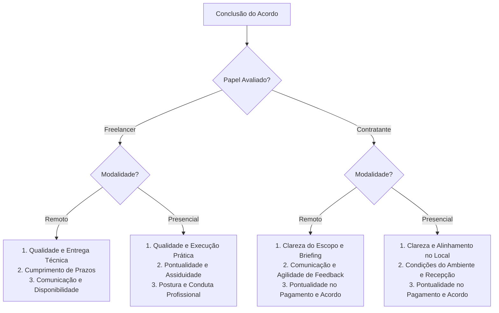

# Proposta de Novos Critérios de Avaliação e Estrutura de Reputação

Este documento estabelece a reestruturação do sistema de avaliação da plataforma, considerando as especificidades de **Freelancers** e **Contratantes**, as modalidades **Presencial** e **Remota**, a regra de negócio de **exatamente 3 critérios (notas em estrelas) por avaliação**, a composição das **mensagens prontas** (tags) exibidas abaixo do termômetro de reputação na tela de anúncio, e as **melhorias na modelagem do banco de dados no Supabase**.

---

## 1. Diagnóstico do Cenário Atual

### 1.1 No Backend e Frontend
- **Backend (Django):** Em `backend/core/serializers.py`, o dicionário `CRITERIOS_AVALIACAO` atualmente fixa 3 critérios genéricos para cada papel:
  - *Freelancer:* `qualidade` (Qualidade da entrega), `comunicacao` (Comunicação), `prazo` (Cumprimento do prazo).
  - *Contratante:* `clareza` (Clareza das instruções), `comunicacao` (Comunicação), `pagamento` (Pagamento e compromisso).
- **Armazenamento:** O modelo `Avaliacao` armazena os critérios em formato JSON (`criterios = models.JSONField(default=dict)`).
- **Frontend:** Na página de detalhes do anúncio (`src/pages/DetalhesAnuncio.jsx`), as mensagens abaixo do termômetro de reputação (`reputacaoInfo`) são textos estáticos (*mockados*), não variando entre perfil de freelancer ou contratante, tampouco refletindo a média real dos critérios do autor do anúncio.

### 1.2 No Banco de Dados (Supabase)
Inspecionando o banco de dados PostgreSQL no Supabase, temos duas tabelas relacionadas:
1. `avaliacoes`:
   - `id` (bigint), `acordo_id` (bigint), `avaliador_id` (bigint), `avaliado_id` (bigint), `papel_avaliado` (varchar), `criterios` (jsonb), `nota_geral` (numeric), `comentario` (varchar), `criada_em` (timestamptz).
2. `criterios_avaliacao`:
   - `id` (bigint, PK)
   - `nota` (smallint)
   - `titulo` (character varying)
   - `avaliacao_id` (bigint, FK para `avaliacoes.id`)

**Limitações da tabela `criterios_avaliacao` atual no Supabase:**
- Possui apenas o `titulo` textual, sem um identificador técnico padronizado (`chave`/`slug`), dificultando agrupamentos (`GROUP BY`), filtros por código e traduções.
- Não possui referência direta ao `papel_avaliado` ('freelancer' ou 'contratante') nem à `modalidade` ('remoto' ou 'presencial'), obrigando *joins* complexos até `acordo_servico` -> `candidaturas` -> `anuncios`.
- Não possui campo de peso (`peso`) para cálculo ponderado de reputação.
- Não possui coluna temporal (`criado_em`) para aplicar decaimento temporal de reputação (avaliar apenas o histórico recente ou ponderar notas mais novas).
- Não possui restrição de integridade `CHECK (nota >= 1 AND nota <= 5)`.

---

## 2. Definição dos Novos Critérios (Exatamente 3 por Avaliação)

A regra de ouro estabelecida é: **cada avaliação deve conter rigorosamente 3 critérios avaliados de 1 a 5 estrelas**. Como a plataforma opera com serviços **Remotos** e **Presenciais**, os critérios devem refletir a realidade prática de cada modalidade.

Apresentamos a **Abordagem Recomendada (Contextual por Modalidade)** e a **Abordagem Alternativa (Unificada)**.

### 2.1 Abordagem Recomendada: Critérios Específicos por Papel e Modalidade
O sistema identifica automaticamente se o acordo concluído teve origem em um anúncio `presencial` ou `remoto` (via `ad.location_type`) e carrega o trio de critérios correspondente:



#### A) Avaliando o FREELANCER

##### 1. Modalidade REMOTA
1. **Qualidade e Entrega Técnica (`qualidade_tecnica`)**: Avalia a fidelidade ao que foi solicitado, ausência de bugs ou erros graves, capricho no material final e atendimento aos padrões técnicos exigidos.
2. **Cumprimento de Prazos (`cumprimento_prazos`)**: Avalia se as etapas parciais e o resultado final foram entregues dentro das datas previamente acordadas.
3. **Comunicação e Disponibilidade (`comunicacao_remota`)**: Avalia o tempo de resposta no chat, clareza ao tirar dúvidas e transparência quanto ao andamento do trabalho.

##### 2. Modalidade PRESENCIAL
1. **Qualidade e Execução Prática (`qualidade_execucao`)**: Avalia a habilidade técnica prática na execução do serviço, apresentação dos equipamentos/ferramentas necessários e capricho no resultado final.
2. **Pontualidade e Assiduidade (`pontualidade_assiduidade`)**: Avalia se o profissional compareceu rigorosamente no dia e horário combinados, cumprindo a jornada ou agenda prevista no local.
3. **Postura e Conduta Profissional (`postura_conduta`)**: Avalia a cordialidade, educação, respeito ao ambiente de trabalho/residência do contratante e aderência a normas de segurança e convivência.

---

#### B) Avaliando o CONTRATANTE

##### 1. Modalidade REMOTA
1. **Clareza de Escopo e Briefing (`clareza_escopo`)**: Avalia se o contratante soube descrever com precisão o que precisava, forneceu os materiais, referências e acessos necessários sem ambiguidades.
2. **Comunicação e Feedback Ágil (`comunicacao_feedback`)**: Avalia a presteza em responder dúvidas do freelancer, testar ou revisar entregas parciais e fornecer direcionamentos em tempo hábil.
3. **Pontualidade e Compromisso Financeiro (`pagamento_compromisso`)**: Avalia o respeito aos prazos de liberação de pagamento e ao valor acordado, sem pedidos de demandas extras fora do combinado ("scope creep").

##### 2. Modalidade PRESENCIAL
1. **Clareza e Alinhamento no Local (`alinhamento_local`)**: Avalia se as tarefas solicitadas no local correspondiam exatamente ao anúncio combinado, sem imposição de serviços não acordados previamente.
2. **Condições do Ambiente e Recepção (`ambiente_recepcao`)**: Avalia se o contratante esteve presente ou disponível para receber o profissional, oferecendo um ambiente seguro, respeitoso e apto à realização do trabalho.
3. **Pontualidade e Compromisso Financeiro (`pagamento_compromisso`)**: Avalia a liberação e honra dos valores e termos contratuais combinados logo após a finalização da visita/serviço.

---

### 2.2 Abordagem Alternativa: Critérios Universais (Caso não se queira bifurcar por modalidade)
Caso a equipe opte por manter rigorosamente os mesmos 3 títulos independente da modalidade, as formulações ideais e abrangentes são:

| Papel | Critério 1 | Critério 2 | Critério 3 |
| :--- | :--- | :--- | :--- |
| **Freelancer** | **Qualidade da Execução** *(Técnica, acabamento e conformidade)* | **Pontualidade e Prazos** *(Prazos de entrega ou pontualidade na chegada)* | **Comunicação e Postura** *(Cordialidade, retorno ágil e ética)* |
| **Contratante** | **Clareza de Instruções** *(Definição do escopo e alinhamento de tarefas)* | **Comunicação e Disponibilidade** *(Respostas ágeis, respeito e feedback)* | **Compromisso e Pagamento** *(Cumprimento de acordos e honra aos valores)* |

---

## 3. Mensagens Prontas para o Termômetro de Reputação na Tela do Anúncio

Na tela de visualização do anúncio (`DetalhesAnuncio.jsx`), logo abaixo da barra colorida do termômetro de reputação, são exibidas **tags dinâmicas** resumindo o perfil do anunciante.

### 3.1 Regra de Cálculo e Seleção das Tags
1. **Média por Critério:** O backend calcula a média aritmética de cada critério recebido pelo usuário ao longo de seus acordos concluídos:
   $$\text{Média do Critério} = \frac{\sum \text{Notas do Critério}}{\text{Total de Avaliações Recebidas}}$$
2. **Classificação das Faixas:**
   - **Alta Excelência ($\ge 4.5$ estrelas):** Gera tag **Positiva** (`tone: 'positivo'`).
   - **Desempenho Regular ($3.0 \le \text{nota} < 4.5$ estrelas):** Não gera alerta negativo, mas pode exibir tag informativa suave ou ser omitida em favor dos pontos de destaque.
   - **Ponto Crítico de Atenção ($< 3.0$ estrelas):** Gera tag de **Alerta** (`tone: 'alerta'`).
3. **Regra de Exibição no Card do Anúncio:**
   - Se o anúncio for publicado por um **Freelancer** oferecendo trabalho: exibe o histórico de tags geradas pelas avaliações dele como prestador.
   - Se o anúncio for publicado por um **Contratante** buscando profissionais: exibe o histórico de tags geradas pelas avaliações dele como contratante.
   - São selecionadas até **3 tags prioritárias**, priorizando alertas (caso existam) para proteção da comunidade, seguidos dos maiores destaques positivos.

---

### 3.2 Catálogo Completo de Mensagens Prontas (Tags)

#### Para Anúncios de FREELANCER

| Critério | Faixa Alta ($\ge 4.5$) | Faixa Média ($3.0 - 4.4$) | Faixa Baixa ($< 3.0$) |
| :--- | :--- | :--- | :--- |
| **Qualidade / Execução** | `[positivo]` **Entrega de alta qualidade técnica e capricho** | `[positivo]` Qualidade dentro do padrão contratado | `[alerta]` **Entregas com necessidade frequente de refações** |
| **Prazos / Pontualidade** | `[positivo]` **Rigoroso no cumprimento de horários e prazos** | `[alerta]` Pontualidade razoável com eventuais atrasos | `[alerta]` **Histórico frequente de atrasos nas entregas** |
| **Comunicação / Postura** | `[positivo]` **Comunicação ágil, transparente e cordial** | `[positivo]` Responde às mensagens em tempo adequado | `[alerta]` **Demora para responder e pouca clareza no contato** |
| **Presencial (Específica)** | `[positivo]` **Excelente postura profissional no local** | `[positivo]` Postura adequada no atendimento | `[alerta]` **Dificuldades de conduta ou postura presencial** |

#### Para Anúncios de CONTRATANTE

| Critério | Faixa Alta ($\ge 4.5$) | Faixa Média ($3.0 - 4.4$) | Faixa Baixa ($< 3.0$) |
| :--- | :--- | :--- | :--- |
| **Clareza de Escopo** | `[positivo]` **Instruções e demandas muito claras e diretas** | `[positivo]` Escopo compreensível com pequenos ajustes | `[alerta]` **Instruções confusas ou mudanças constantes de escopo** |
| **Comunicação e Feedback** | `[positivo]` **Retorno ágil em dúvidas e aprovações** | `[positivo]` Feedback concedido em tempo hábil | `[alerta]` **Demora excessiva para responder e avaliar etapas** |
| **Pagamento e Compromisso** | `[positivo]` **Pagamento pontual e compromisso exemplar** | `[positivo]` Pagamentos e acordos honrados | `[alerta]` **Atrito ou atraso na liberação do pagamento** |
| **Presencial (Específica)** | `[positivo]` **Ambiente seguro, acolhedor e preparado** | `[positivo]` Recepção pontual no local | `[alerta]` **Ambiente presencial incompatível com o combinado** |

---

## 4. Análise e Proposta de Modificações no Banco do Supabase

### 4.1 Estrutura Atual
```
Tabela: criterios_avaliacao
- id: bigint (PK)
- avaliacao_id: bigint (FK -> avaliacoes.id)
- titulo: character varying
- nota: smallint
```

### 4.2 Novas Colunas Sugeridas para a Tabela `criterios_avaliacao`

Para transformar a tabela em um componente escalável e integrado ao termômetro de reputação, propomos a adição das seguintes colunas:

| Coluna Sugerida | Tipo SQL | Nulo? | Descrição e Justificativa |
| :--- | :--- | :--- | :--- |
| **`chave`** | `varchar(50)` | NÃO | Código padronizado do critério (ex: `'qualidade'`, `'prazo'`, `'comunicacao'`). Permite `GROUP BY`, buscas indexadas rápidas e independência de textos ou idiomas. |
| **`papel_avaliado`** | `varchar(20)` | NÃO | Armazena `'freelancer'` ou `'contratante'`. Permite calcular a reputação específica de cada papel sem necessidade de fazer JOIN com a tabela `avaliacoes`. |
| **`modalidade`** | `varchar(20)` | NÃO | Armazena `'remoto'` ou `'presencial'`. Permite segmentar estatísticas e tags por tipo de serviço executado. |
| **`peso`** | `numeric(3,2)` | NÃO (default `1.00`) | Fator multiplicador para ponderação na reputação geral (ex: 1.20 para qualidade técnica, 0.80 para critérios secundários). |
| **`descricao`** | `varchar(255)` | SIM | Texto descritivo/subtítulo exibido no frontend na hora em que o usuário está votando nas estrelas (ex: *"Avalie a pontualidade na entrega"*). |
| **`criado_em`** | `timestamptz` | NÃO (default `now()`) | Timestamp da criação da nota. Permite aplicar políticas de decaimento temporal (ex: notas dos últimos 6 meses têm peso maior que notas de 2 anos atrás). |

### 4.3 Script SQL para Aplicação no Supabase

O script abaixo pode ser executado diretamente no SQL Editor do Supabase ou via migração Django:

```sql
-- 1. Adicionar colunas estruturadas na tabela criterios_avaliacao
ALTER TABLE criterios_avaliacao 
ADD COLUMN IF NOT EXISTS chave varchar(50),
ADD COLUMN IF NOT EXISTS papel_avaliado varchar(20) CHECK (papel_avaliado IN ('freelancer', 'contratante')),
ADD COLUMN IF NOT EXISTS modalidade varchar(20) DEFAULT 'remoto' CHECK (modalidade IN ('remoto', 'presencial')),
ADD COLUMN IF NOT EXISTS peso numeric(3,2) DEFAULT 1.00,
ADD COLUMN IF NOT EXISTS descricao varchar(255),
ADD COLUMN IF NOT EXISTS criado_em timestamp with time zone DEFAULT now();

-- 2. Adicionar constraint de validação das estrelas (1 a 5)
ALTER TABLE criterios_avaliacao 
DROP CONSTRAINT IF EXISTS check_nota_entre_um_e_cinco;

ALTER TABLE criterios_avaliacao 
ADD CONSTRAINT check_nota_entre_um_e_cinco CHECK (nota >= 1 AND nota <= 5);

-- 3. Índices de alta performance para o cálculo do termômetro de reputação
CREATE INDEX IF NOT EXISTS idx_criterios_chave_papel 
ON criterios_avaliacao (chave, papel_avaliado);

CREATE INDEX IF NOT EXISTS idx_criterios_avaliacao_id 
ON criterios_avaliacao (avaliacao_id);

-- 4. Melhoria complementar na tabela avaliacoes:
-- Adicionar a modalidade do serviço na tabela pai para consultas rápidas
ALTER TABLE avaliacoes 
ADD COLUMN IF NOT EXISTS modalidade varchar(20) DEFAULT 'remoto';
```

---

## 5. Como as Peças se Integram no Código

### 5.1 Fluxo de Avaliação (Backend Django)
1. **Identificação do Contexto:**
   Ao concluir o acordo, o endpoint `/api/avaliacoes/pendentes/` verifica:
   - Quem é o avaliador e quem é o avaliado.
   - O `location_type` do anúncio associado (`'remoto'` ou `'presencial'`).
   - Retorna os 3 critérios exatos para o frontend renderizar.
2. **Gravação Dupla (Compatibilidade & Performance):**
   Ao submeter a avaliação via `POST /api/avaliacoes/`:
   - Mantém o registro em `avaliacoes` (com JSON de critérios para compatibilidade retroativa).
   - Insere as 3 linhas individuais em `criterios_avaliacao` com `chave`, `papel_avaliado`, `modalidade` e `nota`.

### 5.2 Fluxo de Exibição no Anúncio (`DetalhesAnuncio.jsx`)
1. O backend inclui no payload do anúncio (`/api/anuncios/{id}/`) os dados consolidados do autor:
   ```json
   {
     "id": 12,
     "title": "Desenvolvimento de Landing Page",
     "author": {
       "id": 5,
       "nome": "Carlos Silva",
       "reputacao_score": 94,
       "reputacao_label": "Excelente",
       "reputacao_tags": [
         { "tone": "positivo", "text": "Entrega de alta qualidade técnica e capricho" },
         { "tone": "positivo", "text": "Rigoroso no cumprimento de horários e prazos" },
         { "tone": "positivo", "text": "Comunicação ágil, transparente e cordial" }
       ]
     }
   }
   ```
2. O componente substitui a função `reputacaoInfo()` estática por esses dados dinâmicos vindos da API, garantindo 100% de consistência entre o que outros clientes avaliaram e o que os novos visitantes enxergam no termômetro.

---

## 6. Próximos Passos Sugeridos
1. **Executar o script SQL no Supabase** para criar as novas colunas e constraints na tabela `criterios_avaliacao`.
2. **Atualizar `CRITERIOS_AVALIACAO` no Django** em `backend/core/serializers.py` para comportar a chave de modalidade (`remoto` / `presencial`).
3. **Persistir os critérios detalhados em `criterios_avaliacao`** dentro do método `create` do `AvaliacaoSerializer`.
4. **Criar a rota/função utilitária de cálculo de tags de reputação** para alimentar o serializer de detalhes do anúncio (`AdDetailSerializer`).
