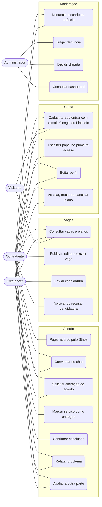
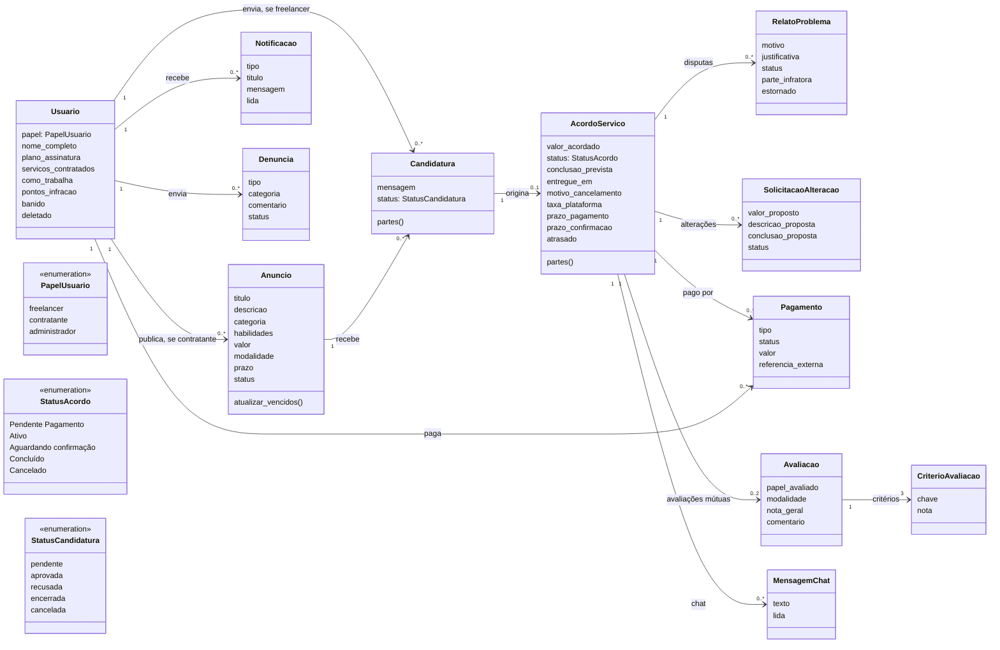
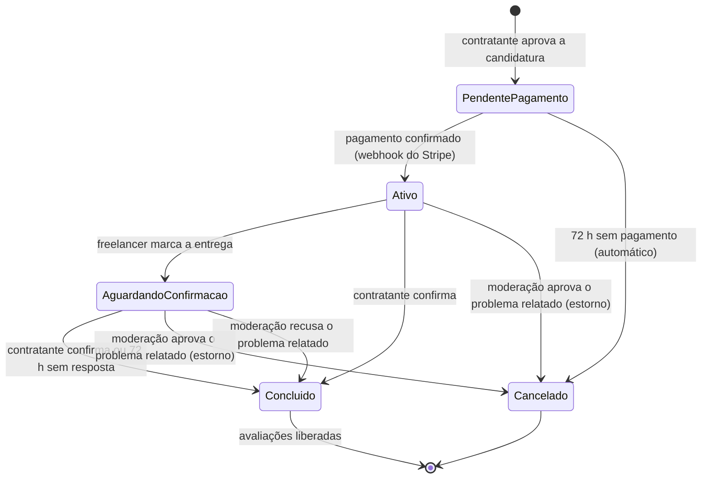
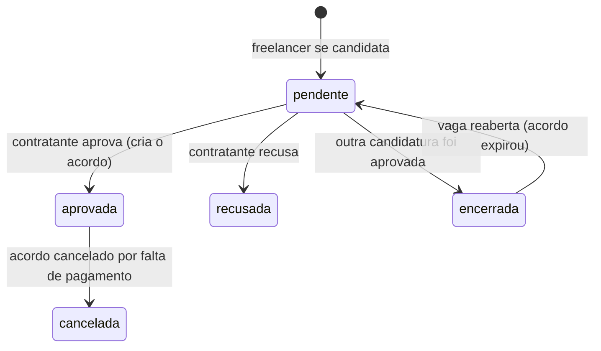
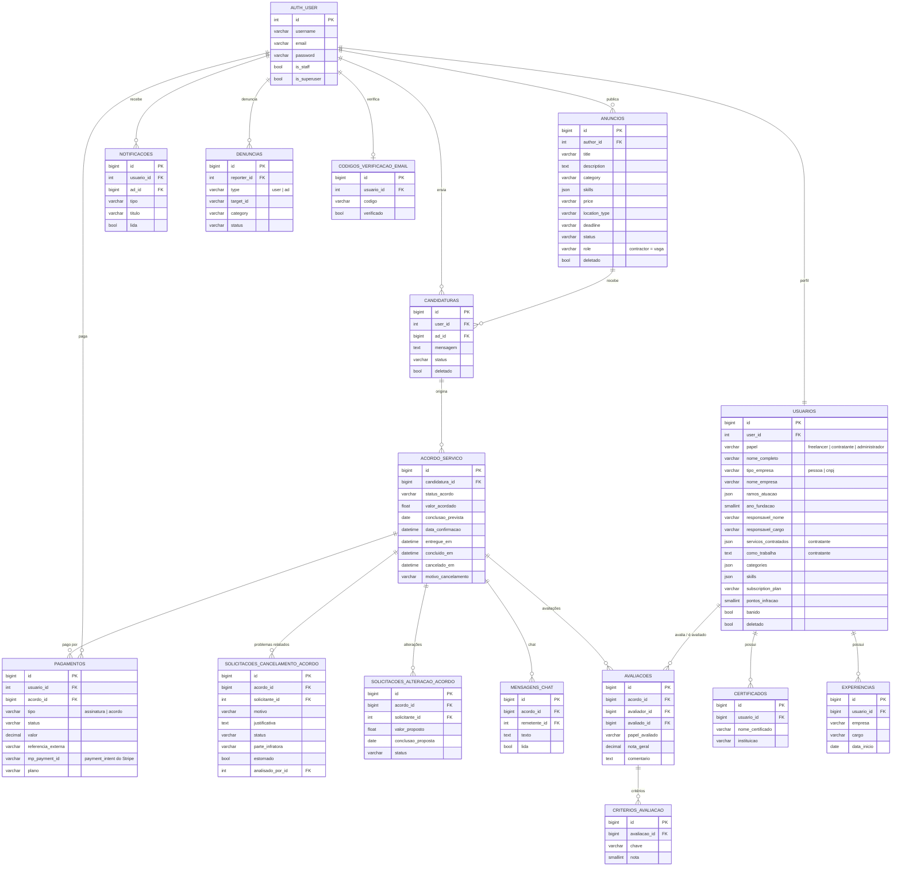
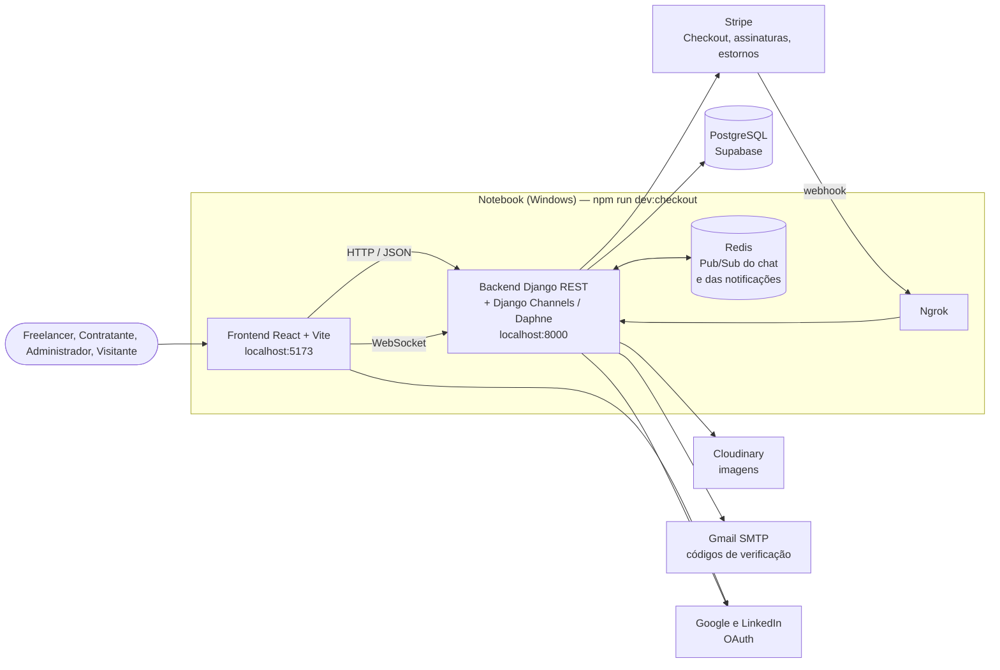

# RT v06 — diagramas

Diagramas atualizados para o relatório técnico, em Mermaid. O GitHub renderiza este arquivo direto. Para colar no .docx, cole cada bloco em <https://mermaid.live> e exporte como PNG ou SVG.

Eles refletem o código atual (`backend/core/models.py`). Os textos de requisitos estão em [`rt-v06-secoes.md`](rt-v06-secoes.md).

## 1. Casos de uso

## 2. Diagrama de classes

A especialização `AnuncioContratante` / `AnuncioFreelancer` do RT v05 saiu: só o contratante publica, então `Anuncio` é uma classe única (vaga). `partes()` devolve o contratante (autor da vaga) e o freelancer (quem se candidatou); `taxa_plataforma` é 10% do valor acordado.

## 3. Estados

### Acordo de serviço

Um problema relatado pendente congela a conclusão automática até a decisão da moderação.

### Candidatura

## 4. Modelo entidade-relacionamento (tabelas usadas pelo Django)

Colunas principais de cada tabela. As tabelas `anuncios` e `candidaturas` mantêm colunas espelhadas herdadas da modelagem inicial do Supabase (`titulo`/`title`, `descricao`/`description`, `valor`/`price`, `usuario_id`/`author_id`), sincronizadas pelo `save()` dos models.

Tabelas do django-allauth (`account_*`, `socialaccount_*`) e do DRF (`authtoken_token`) não aparecem no diagrama. As tabelas legadas do Supabase que o Django não usa (`anuncios_freelancer`, `anuncios_contratante`, `conversas`, `assinaturas`, `denuncia_usuario`, `denuncia_anuncio`, `cancelamento_acordo`, `alteracoes_acordo`, `core_ad`, `core_userprofile`, `cartoes_usuario`) ficam fora do DER.

## 5. Containers

As mensagens do chat são gravadas direto no PostgreSQL; o Redis só entrega as mensagens novas em tempo real aos WebSockets conectados.
